# ros2gobot_hardware

This repository provides all the essential instructions, diagrams, and configurations required to properly build and assemble the robot.


## Bill of Materials (BOM)

| Item # | Image | Component | Purchasing Links | Notes |
|:--:|:--:|:-----------------------:|:--------------------:|:-------------------------------------------------------:|
| 1 | 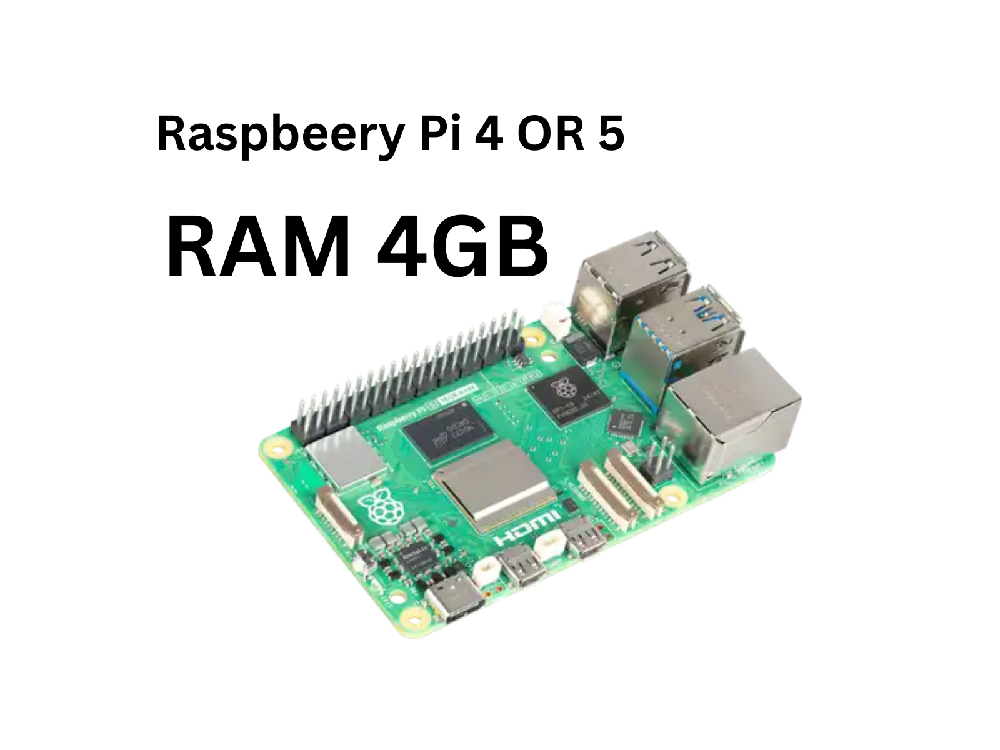 | Raspberry Pi 4 B (4 GB) | [Amazon](https://www.amazon.com/-/es/desarrollo-Multifuncional-Desarrollo-Aprendizaje-Programaci%C3%B3n/dp/B0B7RN5PPN/ref=sr_1_1?crid=2TP47BV2H7KR3&dib=eyJ2IjoiMSJ9.mGPLQSzGdo46mempglSxiyOOBw_6_bzApyMN9nBELUDhMvprgoi-t-zlc_pvFQPc0UNyPoKxyOc7x5dUVNo2yRiEc5D5H-qOEGPiy5Eyj2CATkz6OrMycJRDrRyIgrX_m3PWq5ZgZlfTX6iFeEzh42QTuLopPU1BAjkaUWcv9hbcXvg4bVRpybxgqssX1YJXzkt-sATzkmN5S7Rpe-7_-y-83lx2S6BdC5XR550Oews._M_Ne0Dh3wEIpSbYG6LzQIDHuXtoYlHuBKReSf9LPZg&dib_tag=se&keywords=raspberry+pi+4&qid=1771022722&sprefix=ras%2Caps%2C150&sr=8-1) | We recommend using a Raspberry Pi 5 with 8GB of RAM if you require more processing power.|
| 2 | 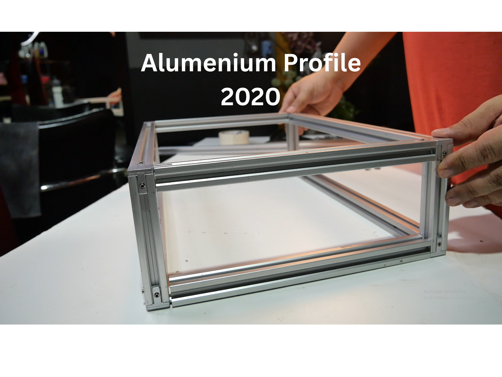 | AlumeniumProfile 2020|  | 40 cm x4 , 26 cm x4 , 12 cm x4 or or the size you need |
| 3 | 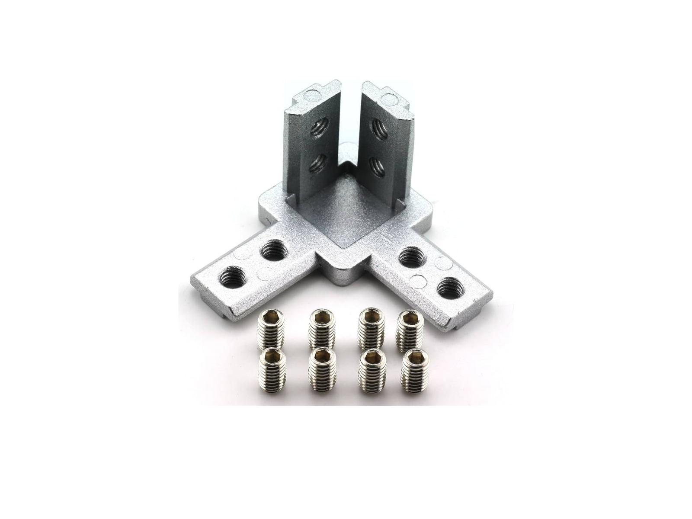 | 3-Way End Corner Bracket Connector X8 |  | You may use other types if they better suit your needs. |
| 4 | 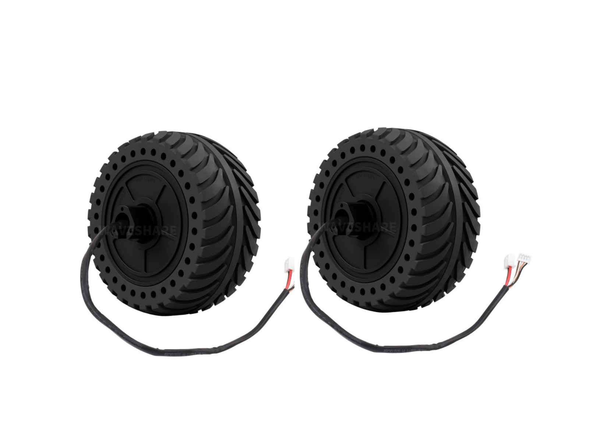 | DDSM115 Direct drive Servo Motor | [waveshare](https://www.waveshare.com/ddsm115.htm) | Single-wheel load: 10kg |
| 5 | 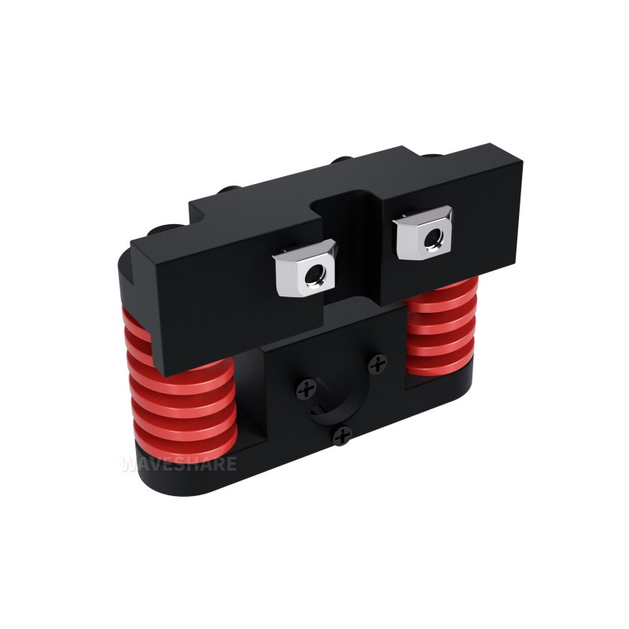 | All-metal Compact UGV Suspension (Option) |  [waveshare](https://www.waveshare.com/ugv-suspension-a.htm)  | All-metal Compact UGV Suspension (A), High-strength Spring, 7.5KG Load|
| 6 | 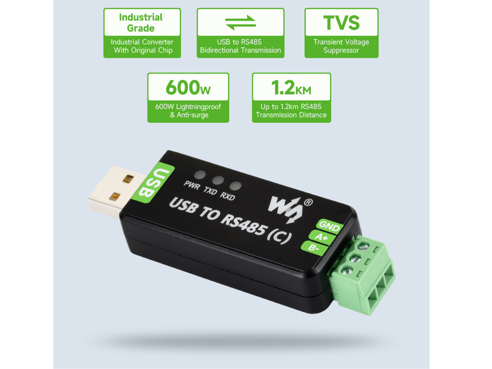 | USB To RS485 |  [waveshare](https://www.waveshare.com/usb-to-rs485-c.htm) | Industrial Grade Isolated Bidirectional Converter, FT232RNL Chip|
| 7 | 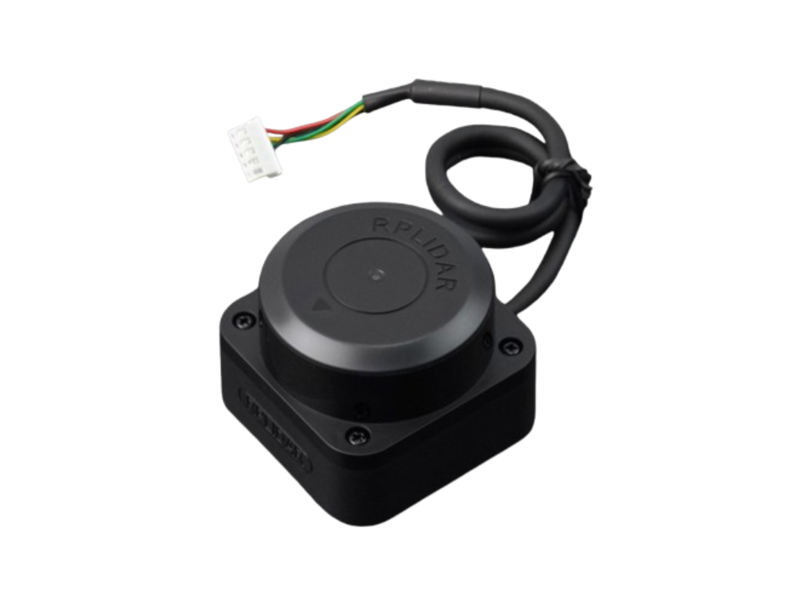 | RPLIDAR C1 | [waveshare](https://www.waveshare.com/rplidar-c1.htm) | Slamtec RPLIDAR C1 Laser Ranging Sensor, 360° Omnidirectional Lidar |
| 8 | 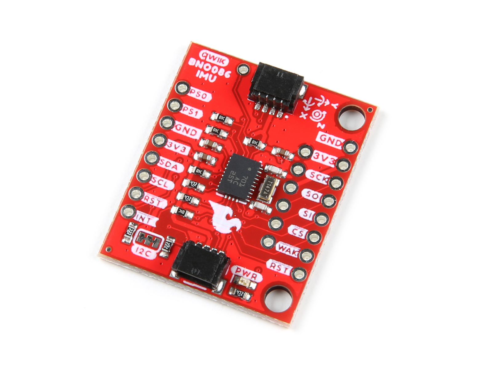 | IMU - BNO086 | [SparkFun](https://www.sparkfun.com/sparkfun-vr-imu-breakout-bno086-qwiic.html?srsltid=AfmBOophMQdNha05HG4xJZNiXzJe88Du7IadXZyFmmkeyGUNtU6TwpG8&affiliate_code=alk5kk4nd6&referring_service=link) | An incredibly precise 9DoF orientation sensor featuring 14-bit accelerometer fusion |
| 9 | 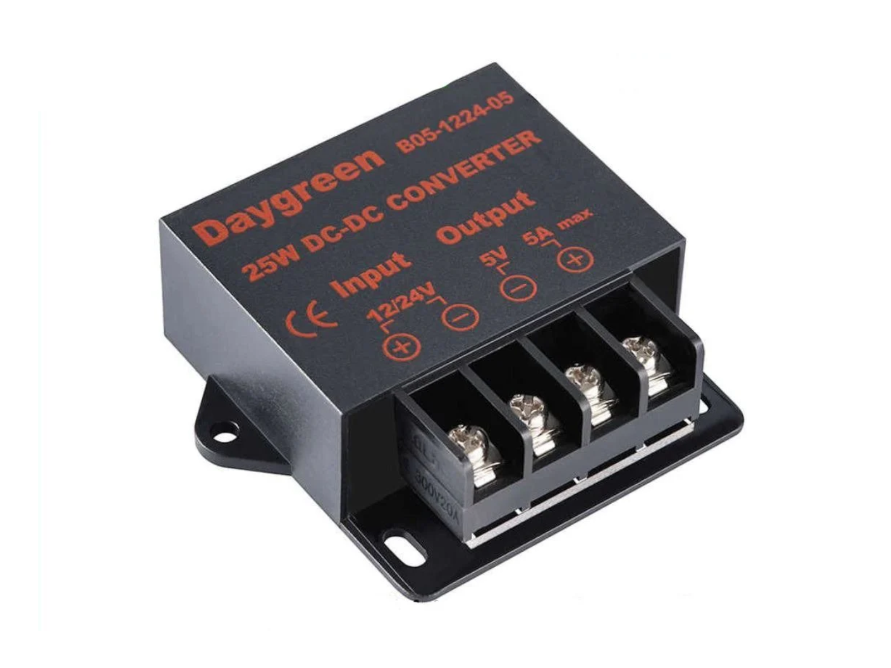 | 7-35V DC to DC 5V 5A | | Converts the input voltage to a stable 5V/5A power supply for the Raspberry Pi 4 or Raspberry Pi 5. |
| 10 | 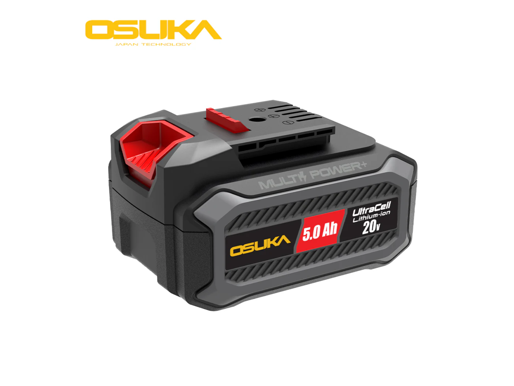 | 18V-24V MAX Power Tool Battery || Any compatible 18V - 24V power tool battery can be used. |
| 11 | 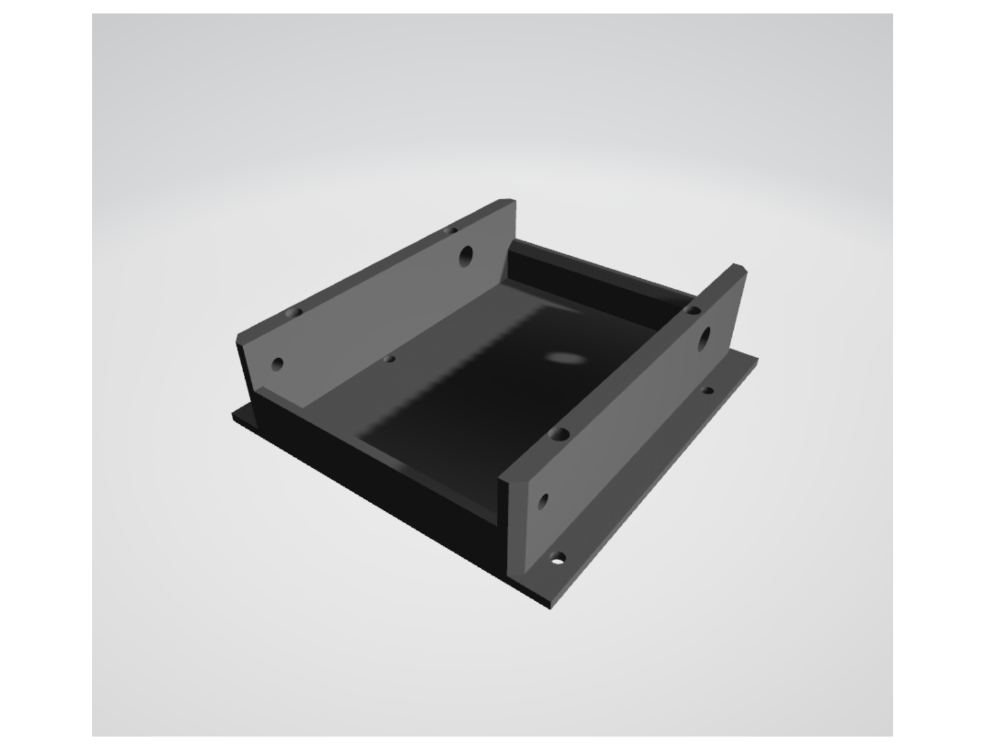 | [OZUKA Battery Mount](https://github.com/ros2gorobotics/ros2gobot/blob/main/ros2gobot_hardware/printing_model/base_batt_up_v3.stl) | | Any compatible 18V - 24V power tool battery can be used. |
| 12 |  | RPLidar A1M8 | [RobotShop](https://www.robotshop.com/products/rplidar-a1m8-360-degree-laser-scanner-development-kit?_pos=3&_sid=b0aefcea1&_ss=r), [Amazon](https://www.amazon.com/RPLIDAR-A1M8-Evitaci%C3%B3n-Obst%C3%A1culos-Navegaci%C3%B3n/dp/B07TJW5SXF/ref=sr_1_1_sspa?__mk_es_US=%C3%85M%C3%85%C5%BD%C3%95%C3%91&crid=6Z65FTP4XRZ&dib=eyJ2IjoiMSJ9.9rz2OfYpvAAEF8dUy6aYwqFhw6U8mCHA81HqCWfHiZMaPQO8jQOW-KuMmijXVXM4heaiaDCFsT9qvaTGa47y18B47pG_dGnbdgR9m_QX-UZ4WmVl0mU_EYa54QhKxx672F65mqmdz2lioURxc_7O3A.SFuniUk-6Gp0R_yL-P5bhzVNQNc-qPg9DkEKZPRvAvk&dib_tag=se&keywords=RPLidar+A1M8&qid=1771023378&sprefix=rplidar+a1m8%2Caps%2C250&sr=8-1-spons&sp_csd=d2lkZ2V0TmFtZT1zcF9hdGY&psc=1) | Ensure you purchase a microUSB-to-USB cable if it is not included in the box. |
| 13 |  | Raspi Camera Module V2 (8MP) | [Robotshop](https://www.robotshop.com/products/raspberry-pi-camera-module-v2), [Amazon](https://www.amazon.com/Raspberry-Pi-Camera-Module-Megapixel/dp/B01ER2SKFS?th=1), [Extended Cable](https://www.amazon.es/AZDelivery-Repuesto-Raspberry-30cm-Flexkabel/dp/B01NAXKTDP/ref=sr_1_9?__mk_es_ES=%C3%85M%C3%85%C5%BD%C3%95%C3%91&crid=I1IK0FQVQCCU&dib=eyJ2IjoiMSJ9.2UYb-3a8M00iHZZiHT0xjp8vfzq-3BSmJSLxdtcCMV6WMj8g5T8T_j5DKX8cESxqnVN01YpV3nX28IuhewGTOsmJ4yF5st20TxU7kHNHftZE_aygB5vT-001wEvUfx70V0H0DZljw0YfC4R2wpjsTR_89pAA95C4F8LhJiGbbUGTEjBgmjnsRIFs6FYatZa9KVusNyv2cKxGZlav36gdoAkMXQUvX578c6frxSnH5DROCeK6bKSqrczA7R8OBVWC995fK1AxHbJLHZJEDQGXMVhUkHd2liBV0nq48mnyE6Q.nHty4TxSpldkH8FZAia_rx7sX6c2uIBpPRUEqwq5NiY&dib_tag=se&keywords=raspberry%2Bpi%2Bcamera%2Bcable&qid=1716878948&sprefix=raspberry%2Bpi%2Bcamera%2Bcable%2Caps%2C76&sr=8-9&th=1)  | A 30cm ribbon cable is linked here just in case the stock cable proves too short. |
| 14 |  | Battery Holder | [Amazon](https://www.amazon.es/GTIWUNG-Soporte-Bater%C3%ADa-Almacenamiento-Pl%C3%A1stico/dp/B08CY5JKG4/ref=sr_1_5?__mk_es_ES=%C3%85M%C3%85%C5%BD%C3%95%C3%91&crid=14DBV6GMV9YIP&dib=eyJ2IjoiMSJ9.AiAmesc8h9MLdB6hmFQT4tzk_lWRWqH1soWP-mWBVQlusnlIziwGRyxc186s679Nd6KCvuJp5GEkinpVWIgSnQY_Y1CZaS0YD-KcJp73pDv4SKvSLKpKYQwfbtTV32_wsMqZrpZWJ_pJYOgDwif19DcMCtdmk5Xf3m4SrukOng3C-7gHiznzr0tLgOyv2EJdech-W6m0tJtl10II1eTnq1gz89W4GK3PW1Nb-Mc8fwr17el3KvvrkYBEvDrnhfdfdG-wwy0EH7xOAmrrDYiOSOlqEXP38Sj7ZYg6atB_axk.ZGQqYl_z8bP5Xg1xgjbRm7xW1ty1oA0oaW4B70268L0&dib_tag=se&keywords=18650%2Bbattery%2Bcase%2B3&qid=1771027178&sprefix=18650%2Bbattery%2Bcase%2B3%2Caps%2C423&sr=8-5&th=1) | The link is for a 6-pack, though you only need a single holder. |
| 15 |  | 18650 Batteries | [Amazon](https://www.amazon.es/18650-Recargable-Unidades-Descarga-Soldadura/dp/B0FP6536TP/ref=sr_1_15?__mk_es_ES=%C3%85M%C3%85%C5%BD%C3%95%C3%91&crid=M4U5RCR55YN1&dib=eyJ2IjoiMSJ9.jFIzKfW_3oqvbUs3OnPuQilyGIEcqtutqxTkGORK6lpAovDhnXWTm5Yix_F5ydJWaX86sSlzT8BBfQOsQGgPMVOnfXTSl1C-t_v1OZgr25FyyN9yqrViLuXbwEJZKsnqP5MaFVp-PpBaUSxASMbSuXH11COgilp8xs0pKzblla_0Wul7YktN9H0kfAMqlVTxZ8A4KStBmtkZIwBf8BA9P0fruKy2a1xlIDb1VUJ9Av5Cy6YgfbI71n0WpSdn6UZDIObHhvPXmS51t3HrWSKplddyTB0cEXzQuxxBJ6MU3-I.GinFCd0nw6TBRYZFrZsIWg0D3qy2khbYxTYAeOUuHyM&dib_tag=se&keywords=18650+batteries&qid=1771026847&sprefix=18650+batter%2Caps%2C442&sr=8-15) | Any standard 18650 cells will work perfectly. |
| 16 |  | Battery Charger | [Amazon](https://www.amazon.es/REACELL-Cargador-Inteligente-R%C3%A1pido-Recargable/dp/B0BNPCMNGZ/ref=sr_1_9?__mk_es_ES=%C3%85M%C3%85%C5%BD%C3%95%C3%91&crid=1145KJVG7QLLJ&dib=eyJ2IjoiMSJ9.AiAmesc8h9MLdB6hmFQT4tzk_lWRWqH1soWP-mWBVQlfWpxCQL2S-wweBItVcUZNpDFi-tDugEBzD4GyGI7cqxP91okI-rxfZCR1_v0BkR34SKvSLKpKYQwfbtTV32_wsMqZrpZWJ_pJYOgDwif19HJw9zLJGvUjCXpIuQXR2CFjl6RAixXLmmiybQAyPT2Fwxrf-vCF-psNvELBs_YVwprGp2PQZKVZvXfMSN9ceXv3GIu5kk3PzPMlTNaRtTPo8JWly-woqa3o7QXVK9kTj-lqEXP38Sj7ZYg6atB_axk.vKZ5XsA5t5sjahvQsLEJ1xbEZofTXhnjn66-dLbn0Mc&dib_tag=se&keywords=18650+battery+case+3&qid=1771026748&sprefix=18650+baterry+case+%2Caps%2C431&sr=8-9) | Any 18650 charger will suffice (e.g., a multi-bay unit). |
| 17 |  | DC-DC Step-Down | [Amazon](https://www.amazon.com/-/es/Adaptador-corriente-compatible-Raspberry-autom%C3%B3vil/dp/B09DGDQ48H/ref=sr_1_3?__mk_es_US=%C3%85M%C3%85%C5%BD%C3%95%C3%91&crid=2F9EDCW5A81YU&dib=eyJ2IjoiMSJ9.Dzh0FWbiiGTjQ8TuE9-5d7ve2ZNtAFn5kYrHT9HeK1R9n7cUSDWuYMXdJGyD9HcAv7Rb7tKCXZDTP4B5j9VSO4x_Hyg4oUOYsWDstc6WSS-w2dQh1dhSTEQ3ZdY0jJFBkADqXp2iTqFtGAbKFiR7F-dLwEIRR2y948q8oxcJO904XB91QB70CwJyA-8p1mZeictRqIEbb4m_5mZrXF4U8DJYquii8kKvEweyAN7Gd2s.oWCZlWJZVtrTbw4LU2zVIqdkDA6VStudh_zDdw_iwjs&dib_tag=se&keywords=dc%2Bdc%2Bstep%2Bdown%2Busb%2Bc&qid=1771024289&sprefix=dc%2Bdc%2Bstep%2Bdown%2Busb%2Bc%2Caps%2C194&sr=8-3&th=1) | Requires a regulator capable of taking 12V input and delivering 5V output at a minimum of 3A. |
| 18 |  | Rocker/Kill Switch | [Amazon](https://www.amazon.com/interruptor-basculante-encendido-interruptores-cuadrados/dp/B0CS96LX3V/ref=sr_1_33_sspa?__mk_es_US=%C3%85M%C3%85%C5%BD%C3%95%C3%91&crid=BKWXR2ZJGOJN&dib=eyJ2IjoiMSJ9.H2gIXvIBQb9Rm35su7Md9zwyr8Gptf1vTzMs4pM6pITGjHj071QN20LucGBJIEps.wS84pF1tUpmJZATTu-NYupgOL2yhl0xAL4PPmUfxyWI&dib_tag=se&keywords=interruptor%2B12V%2Bcon%2Bluz&qid=1771040005&sprefix=interruptor%2B12v%2Bcon%2Blu%2Caps%2C256&sr=8-33-spons&xpid=oohU7DE__5G1B&sp_csd=d2lkZ2V0TmFtZT1zcF9hdGZfbmV4dA&th=1) | Mounting hole dimensions: 13 x 20 mm. |
| 19 |  | Caster Wheel | [Amazon](https://www.amazon.es/Unidades-Peque%C3%B1as-Dispositivo-Transferencia-Transporte/dp/B098XHYW7F/ref=asc_df_B098XHYW7F/?tag=googshopes-21&linkCode=df0&hvadid=529604577974&hvpos=&hvnetw=g&hvrand=15132275207682237467&hvpone=&hvptwo=&hvqmt=&hvdev=c&hvdvcmdl=&hvlocint=&hvlocphy=9181150&hvtargid=pla-1396749454795&psc=1&mcid=b1df85a65d163e89b507de60e73f9e65) | - |
| 20 | SD Card | 64 GB MicroSD | [Apokin](https://www.apokin.es/tarjeta-microsd-philips-64gb-class10.html), [Amazon](https://www.amazon.es/Kingston-Tarjeta-SDCS2-64GB-Adaptador/dp/B07YGZQ4H8/ref=sr_1_7?dib=eyJ2IjoiMSJ9.zE4PI6DCNK3d78rtl5ga1NQXGwJT1jC2iqi3mXNzbdJ4BosAUPCn9gc13Gc7pdHDx-7wTy4CDj0zIlgDpu9qXH-6GLgI--pJbfi3OvTBPhwwH-tfi1OzM9xqcAOJG6pJuTtkknsyFk6Ma2EHJ4UdheaziDC_KKaWNKgsf_DFbcA-ZxQSXlTtQqwHvCzgi8hq4vKGiEIY-LSZS_sXE9IUGroo0Isl59Po2IXhTBG5IHnnsVR_7lo0dVBVFYl-5GY2CvJbrixULuPl90TbFTTP6DoIeDcpFdDTcbvSK3Lecss.WXBgIZllFgQxx13Szl3q6WIlTOliwrN8V42J1SzNJ8o&dib_tag=se&qid=1714552555&refinements=p_n_feature_browse-bin%3A948155031&s=computers&sr=1-7) | Used for installing the Raspberry Pi operating system. |
| 21 | 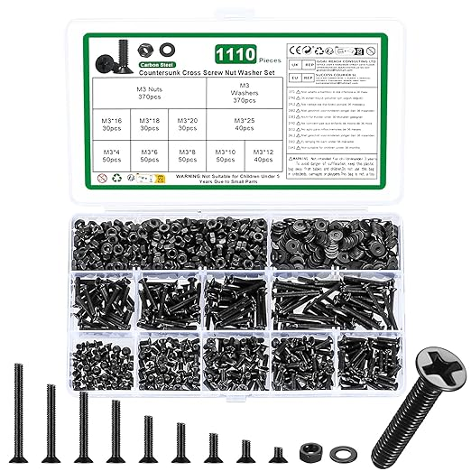 | Screw Assortment | [Amazon](https://www.amazon.es/tornillos-avellanada-tuercas-surtido-roscados/dp/B0DQCSK3QR/ref=sr_1_5_sspa?__mk_es_ES=%C3%85M%C3%85%C5%BD%C3%95%C3%91&crid=AFF5F7FYBDUB&dib=eyJ2IjoiMSJ9.ZUD2S05GEuuoyW7sRYNpgDhWHJaADc8wpON9Sg2wys0v9XqOfz8oKGDaqaZmUBlSabjBiFTIzkPlEf7ON5uiBZQ6OB1aZ0UGrGfFlrLE_mLmdQdLaSQVmEVvBE995BLlvjqut8I6yvXme12RA2VJzG13WLi1qOVixQ4myjtnnA3B9wk505ZL4ZExdsJFdvVqtQLxRzIgXXnL9U53sOX0kBuBVFWmZH6vDgydNCoBzj-wa6JdoQE-axAzkKKTW0GYjZ0qi7ey6OC5UbLatuOEDGTK53V8xWL9xX1dhzlG4R4.8WkDmd8CW8NBbORnmVYv2NaSBqNEOT0Lb3NoxMatrQk&dib_tag=se&keywords=M3%2Bscrews%2Bkit&qid=1771027282&sprefix=m%2Bscrews%2Bkit%2Caps%2C325&sr=8-5-spons&aref=kiRFD1FbHJ&sp_csd=d2lkZ2V0TmFtZT1zcF9hdGY&th=1) | The kit contains everything you need. Check the [screw-table](#screw-table) for exact counts. |
| 22 |  | Zip Ties | [Amazon](https://www.amazon.com/ANOSON-tama%C3%B1os-pulgadas-resistentes-ultravioletas/dp/B0C2Z4L3S6/ref=sr_1_1_sspa?crid=2ZYM3RCU9OJ6E&dib=eyJ2IjoiMSJ9.yZ0eRA1tzbb2B37cITr4PLcStxxj1qdg5A10dy_E0ezu8RIc4Fsujpp2th3NXioZhTWgEQY-t4G5stldZ3mBP8nybzClHFN8dAmpdJGnX-DcVRUU3QcjpUohrfpgF7DLDsZSWdQxwK6C0eVrN31-BFKqK8takJlzA2qCquWuRI0QuBOm8RH4aCXwCk4RaKm_HFv91p-TSKEUWS9vCXwHJ9Q_w2RV0SOWn1Pc_ywMLXg.jU38936ZP5XD-iN9xdjLrik2UqqlSPLezCuR95I5Acg&dib_tag=se&keywords=zip%2Bties&qid=1771040286&sprefix=zip%2Caps%2C241&sr=8-1-spons&sp_csd=d2lkZ2V0TmFtZT1zcF9hdGY&th=1) | You will only end up using about 4 to 6 ties for cable management. |

### Fasteners (Screw Table)

| Thread Size | Length | Required Quantity |
|:--:|:------:|:--------------------:|
| M3 | 6mm | 0 |
| M3 | 8mm | 2 |
| M3 | 10mm | 4 |
| M3 | 12mm | 6 |
| M3 | 16mm | 5 |
| M3 | 20mm | 0 |
| M3 | 25mm | 2 |
| M3 | 30mm | 4 |
| M3 | Nuts | 19 |

### Tools Required

| # | Tool Description | Links | Notes |
|:--:|:------:|:--------------------:|:-------------------------------------------------------:|
| 1 | Screwdriver Set | [Amazon]() | |

---

## Hardware Assembly

### 1. Mounting the Caster Wheel 
Flip the main base chassis upside down and secure the rear caster wheel into place.


Once attached, flip the chassis back over.


### 2. Attaching Motors and the IMU
Secure both drive motors using the four 30mm screws. Next, strap the IMU board onto its designated mount using a zip tie, as depicted below.


### 3. Setting Up the Camera
Thread the camera's ribbon cable down through the slot located under the IMU mount.


Carefully slot the camera module into its 3D-printed housing.


Snap the completed camera assembly onto the chassis. **Be gentle** when expanding the base clips so they don't snap.


### 4. Installing the SBC (Raspberry Pi) and Wheels
Turn the chassis 180 degrees to easily mount the Raspberry Pi board. Then, press the wheels firmly onto the motor shafts.


### 5. Wiring the Motor Driver
Connect the main power line and the 5V line to the L298N motor driver. Leave at least 15cm of slack for the power wires.


Complete the rest of the driver wiring by referencing the [Connection Diagram](#motor-arduino). Once wired, set it into place.


### 6. Arduino Integration
Snap the Arduino Nano into its dedicated lock base bracket.


Finish hooking up the cables according to the [Connection Diagram](#motor-arduino), and use zip ties to keep the wiring tidy.


### 7. Assembling the Lidar Module
Mount the RPLidar scanner onto its 3D-printed base.


Secure the Lidar's USB driver board to the base with zip ties.


Finally, seat the entire Lidar structure on top of the main chassis and screw it down firmly.


### 8. Prepping the Battery Housing
Install the 5V DC-DC step-down converter and the master kill-switch into the upper battery chassis.


The external view should match this picture:


Slide the 18650 battery holder into the chassis cavity.


### 9. Bringing It All Together
Complete the power routing based on the [Power Connection Schema](#raspberry-power). Attach the upper battery chassis to the lower base chassis.


### 10. Completed Build
Your fully assembled ros2gobot should look like this!


---

<a name="connection-diagram"></a>
## Wiring Guide

### Arduino & Motor Logic


**Troubleshooting Common Wiring Issues:**
- **Reversed Motors:** If a motor spins backward relative to the other (verify chassis orientation), simply swap its `+` and `-` wires at the L298N output block.
- **Inverted Encoders:** When the robot drives forward, encoder counts must go up. If they go down, flip the A and B signal wires for that specific encoder.

### Power & Raspberry Pi Layout


> [!NOTE]
> Wiring the ground pin on the kill-switch is only necessary if your switch features a built-in LED indicator.

> [!NOTE]
> Double-check the Pi Camera ribbon cable: the exposed contacts (usually blue or silver backing) must face the USB ports when inserted into the Pi.

---

## Firmware Setup (Microcontroller)

To flash the Arduino Nano with the correct logic, please jump over to the [`ros2gobot_firmware`](../ros2gobot_firmware/README.md) package instructions.

## Single Board Computer (Raspberry Pi) Setup

This project uses a Raspberry Pi 4B as its brain (SBC). While these steps are tailored for the Pi, the underlying concepts apply to other SBCs as well.

If you prefer an automated setup, **we highly recommend using the community-maintained Ansible playbooks:** See [ros2gobot_ansible_config](https://github.com/garyservin/ros2gobot_ansible_config). To configure it manually, follow the steps below.

### 1. Operating System

Select your OS based on the ROS 2 distribution you intend to run:
- **ROS 2 Humble:** Ubuntu Mate 22.04 ARM64 - [Download Here](https://ubuntu-mate.org/download/arm64/)
- **ROS 2 Jazzy:** Ubuntu Server/Desktop 24.04 - [Download Here](https://ubuntu.com/download/raspberry-pi)

> [!IMPORTANT]
> Both Desktop and Server variants work fine, though Desktop builds naturally consume more overhead. For detailed Pi flashing guides, check the [official Ubuntu Docs](https://ubuntu.com/download/raspberry-pi).

**Installation Steps:**
1. Grab the correct image from the links above.
2. Flash it to your microSD card using the [Raspberry Pi Imager](https://www.raspberrypi.com/software/).
3. Insert the SD card into the Pi, hook up an HDMI monitor, and boot it. Follow the setup wizard. We suggest a simple credential pair for convenience (e.g., User: `pi`, Password: `admin`).
4. Open a terminal and run `sudo apt update && sudo apt upgrade` to grab the latest system packages. Reboot once finished.

### 2. Installing Core Dependencies

#### Enable SSH Access
You'll likely want to command the robot remotely. Let's enable the SSH daemon:
```bash
sudo apt-get install openssh-server
sudo systemctl enable ssh --now
