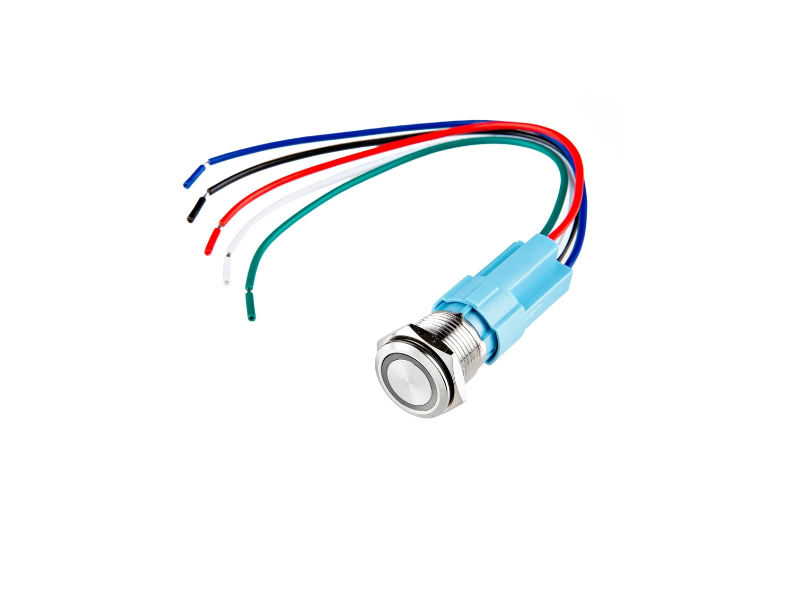
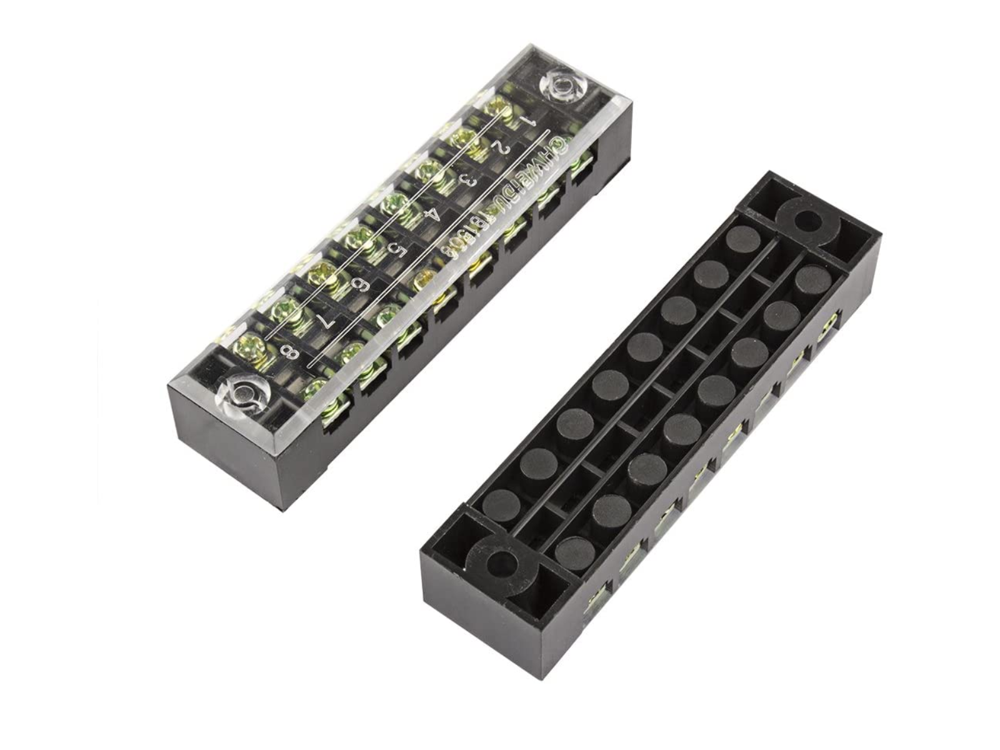
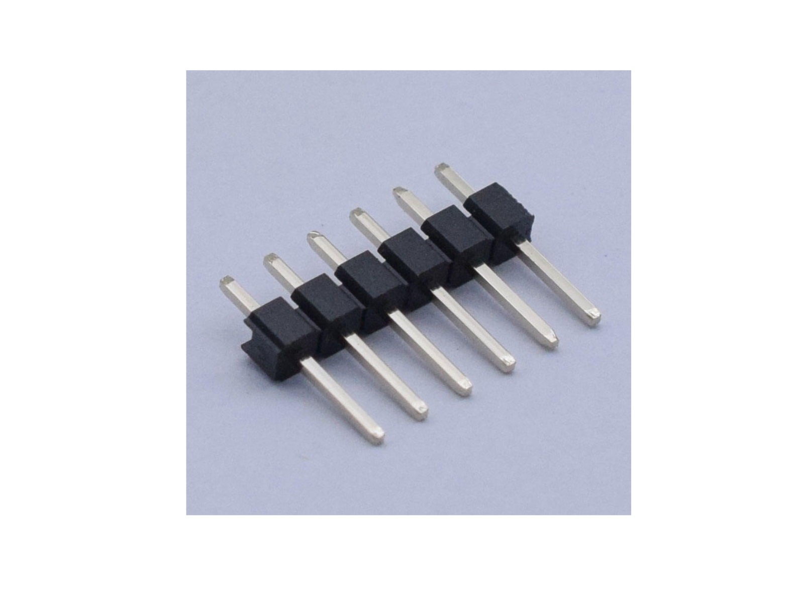
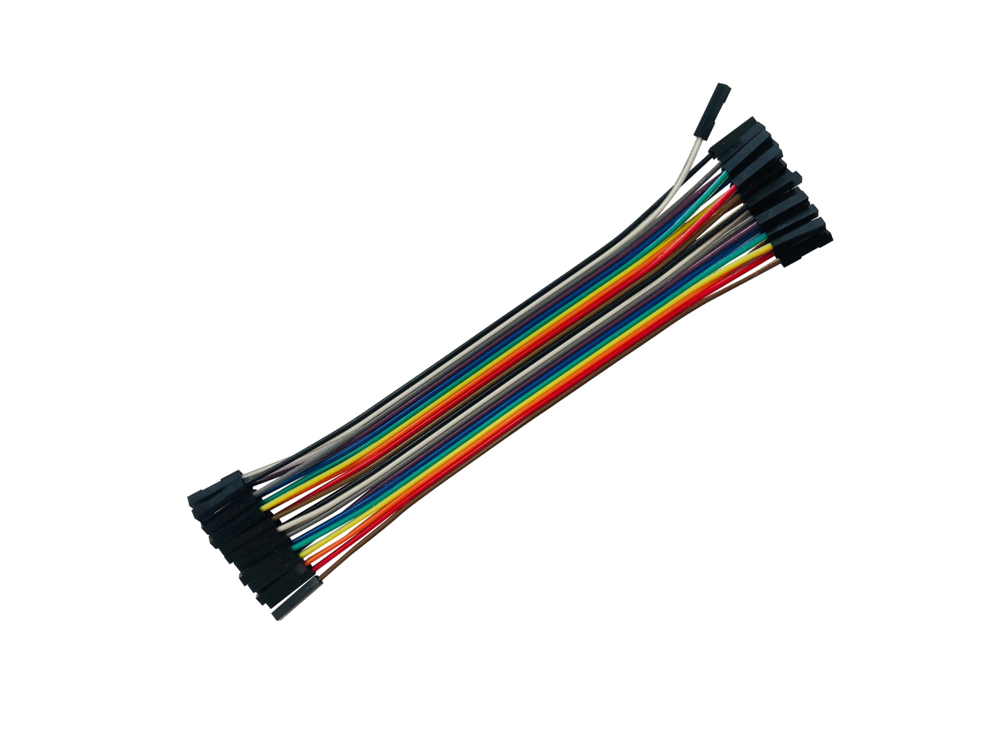
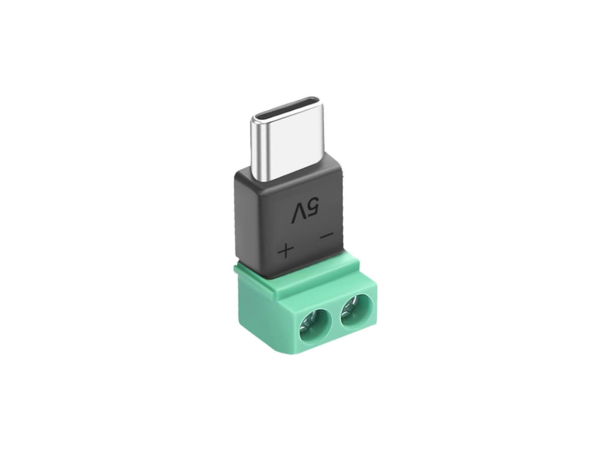
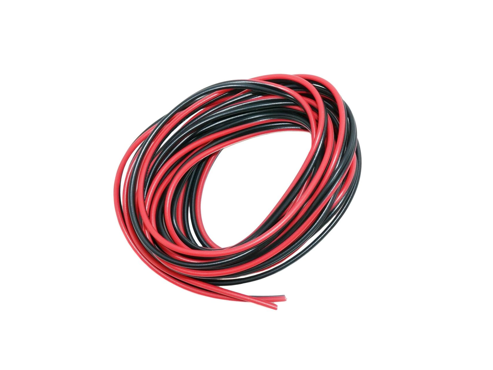
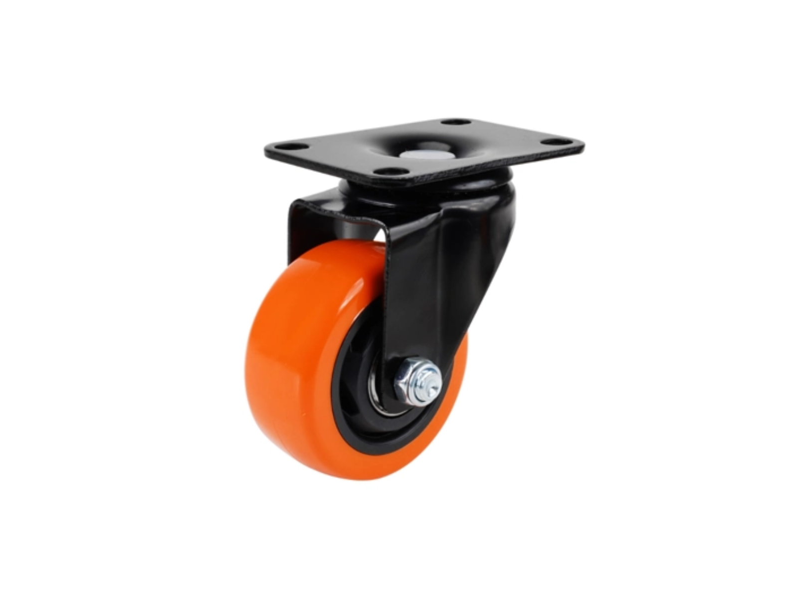

# ros2gobot_hardware

Repository นี้รวบรวมคำแนะนำ ไดอะแกรม และการตั้งค่าที่จำเป็นทั้งหมดสำหรับการประกอบและสร้างหุ่นยนต์อย่างถูกต้อง

## รายการวัสดุอุปกรณ์ (Bill of Materials - BOM)

| ลำดับ | รูปภาพ | อุปกรณ์ | ลิงก์สั่งซื้อ | หมายเหตุ |
|:--:|:--:|:-----------------------:|:--------------------:|:-------------------------------------------------------:|
| 1 |  | Raspberry Pi 4 B (4 GB) | [Amazon](https://www.amazon.com/-/es/desarrollo-Multifuncional-Desarrollo-Aprendizaje-Programaci%C3%B3n/dp/B0B7RN5PPN/ref=sr_1_1?crid=2TP47BV2H7KR3&dib=eyJ2IjoiMSJ9.mGPLQSzGdo46mempglSxiyOOBw_6_bzApyMN9nBELUDhMvprgoi-t-zlc_pvFQPc0UNyPoKxyOc7x5dUVNo2yRiEc5D5H-qOEGPiy5Eyj2CATkz6OrMycJRDrRyIgrX_m3PWq5ZgZlfTX6iFeEzh42QTuLopPU1BAjkaUWcv9hbcXvg4bVRpybxgqssX1YJXzkt-sATzkmN5S7Rpe-7_-y-83lx2S6BdC5XR550Oews._M_Ne0Dh3wEIpSbYG6LzQIDHuXtoYlHuBKReSf9LPZg&dib_tag=se&keywords=raspberry+pi+4&qid=1771022722&sprefix=ras%2Caps%2C150&sr=8-1) | แนะนำให้ใช้ Raspberry Pi 5 รุ่น RAM 8GB หากคุณต้องการพลังประมวลผลที่มากขึ้น |
| 2 |  | อลูมิเนียมโปรไฟล์ 2020 | | 40 ซม. x4 , 26 ซม. x4 , 12 ซม. x4 หรือตามขนาดที่คุณต้องการ |
| 3 |  | ข้อต่อเข้ามุม 3 ทาง X8 | | สามารถใช้แบบอื่นได้หากเหมาะสมกับความต้องการมากกว่า |
| 4 |  | มอเตอร์ DDSM115 Direct drive Servo | [waveshare](https://www.waveshare.com/ddsm115.htm) | รับน้ำหนักต่อล้อ: 10 กก. |
| 5 |  | ชุดกันสะเทือน UGV โลหะ (ตัวเลือกเสริม) | [waveshare](https://www.waveshare.com/ugv-suspension-a.htm) | ชุดกันสะเทือน UGV แบบโลหะกะทัดรัด (A), สปริงความแข็งแรงสูง, รับน้ำหนัก 7.5 กก. |
| 6 |  | ตัวแปลง USB เป็น RS485 | [waveshare](https://www.waveshare.com/usb-to-rs485-c.htm) | ตัวแปลงสัญญาณแบบสองทิศทางชนิดแยกวงจรระดับอุตสาหกรรม, ชิป FT232RNL |
| 7 |  | RPLIDAR C1 | [waveshare](https://www.waveshare.com/rplidar-c1.htm) | เซนเซอร์วัดระยะด้วยเลเซอร์ Slamtec RPLIDAR C1, Lidar รอบทิศทาง 360° |
| 8 |  | IMU - BNO086 | [SparkFun](https://www.sparkfun.com/sparkfun-vr-imu-breakout-bno086-qwiic.html?srsltid=AfmBOophMQdNha05HG4xJZNiXzJe88Du7IadXZyFmmkeyGUNtU6TwpG8&affiliate_code=alk5kk4nd6&referring_service=link) | เซนเซอร์วัดทิศทาง 9DoF ที่มีความแม่นยำสูงเยี่ยม พร้อม accelerometer fusion 14 บิต |
| 9 |  | โมดูลแปลงไฟ DC 7-35V เป็น DC 5V 5A | | แปลงแรงดันไฟขาเข้าเป็นไฟ 5V/5A ที่เสถียรสำหรับ Raspberry Pi 4 หรือ Raspberry Pi 5 |
| 10 |  | แบตเตอรี่เครื่องมือช่าง 18V-24V MAX | | สามารถใช้แบตเตอรี่เครื่องมือช่าง 18V - 24V ที่เข้ากันได้ |
| 11 |  | [แท่นยึดแบตเตอรี่ OZUKA](https://github.com/ros2gorobotics/ros2gobot/blob/main/ros2gobot_hardware/printing_model/base_batt_up_v3.stl) | | |
| 12 |  | สวิตช์ปุ่มกดเปิด/ปิด 24V | | |
| 13 |  | เทอร์มินอลบล็อก TB-1508 | | |
| 14 |  | จัมเปอร์เทอร์มินอล TB15xx | | |
| 15 |  | พินเฮดเดอร์ตัวผู้แถวเดี่ยวแบบตรง 2.54 มม. | | |
| 16 |  | ชุดสายจัมเปอร์ เมีย-เมีย | | |
| 17 |  | USB-C 2 พิน (สำหรับจ่ายไฟเท่านั้น) | | |
| 18 |  | สายไฟ 18 AWG สีแดงและดำ | | |
| 19 |  | ล้อคาสเตอร์แบบหมุนได้ 2.5 นิ้ว | | - |
| 20 |  | MicroSD 64 GB | | แนะนำให้ใช้ MicroSD card 64GB รุ่น High Endurance เพื่อความเสถียรและอายุการใช้งานที่ยาวนานขึ้น |
| 21 |  | ชุดสกรู | | ชุดนี้มีทุกอย่างที่คุณต้องการ ตรวจสอบจำนวนที่แน่นอนใน [ตารางสกรู](#screw-table) |
| 22 |  | เคเบิ้ลไทร์ | [Amazon](https://www.amazon.com/ANOSON-tama%C3%B1os-pulgadas-resistentes-ultravioletas/dp/B0C2Z4L3S6/ref=sr_1_1_sspa?crid=2ZYM3RCU9OJ6E&dib=eyJ2IjoiMSJ9.yZ0eRA1tzbb2B37cITr4PLcStxxj1qdg5A10dy_E0ezu8RIc4Fsujpp2th3NXioZhTWgEQY-t4G5stldZ3mBP8nybzClHFN8dAmpdJGnX-DcVRUU3QcjpUohrfpgF7DLDsZSWdQxwK6C0eVrN31-BFKqK8takJlzA2qCquWuRI0QuBOm8RH4aCXwCk4RaKm_HFv91p-TSKEUWS9vCXwHJ9Q_w2RV0SOWn1Pc_ywMLXg.jU38936ZP5XD-iN9xdjLrik2UqqlSPLezCuR95I5Acg&dib_tag=se&keywords=zip%2Bties&qid=1771040286&sprefix=zip%2Caps%2C241&sr=8-1-spons&sp_csd=d2lkZ2V0TmFtZT1zcF9hdGY&th=1) | คุณจะใช้เพียง 4 ถึง 6 เส้นเท่านั้นเพื่อจัดระเบียบสายไฟ |

<a name="screw-table"></a>
### อุปกรณ์ยึด (ตารางสกรู)

| ขนาดเกลียว | ความยาว | จำนวนที่ต้องการ |
|:--:|:------:|:--------------------:|
| M3 | 6 มม. | 0 |
| M3 | 8 มม. | 2 |
| M3 | 10 มม. | 4 |
| M3 | 12 มม. | 6 |
| M3 | 16 มม. | 5 |
| M3 | 20 มม. | 0 |
| M3 | 25 มม. | 2 |
| M3 | 30 มม. | 4 |
| M3 | น็อตตัวเมีย (Nuts) | 19 |

### เครื่องมือที่จำเป็น

| ลำดับ | รายละเอียดเครื่องมือ | ลิงก์ | หมายเหตุ |
|:--:|:------:|:--------------------:|:-------------------------------------------------------:|
| 1 | ชุดไขควง | [Amazon]() | |

---

## การประกอบฮาร์ดแวร์

### 1. การติดตั้งล้อคาสเตอร์
พลิกโครงแชสซีหลักคว่ำลงและยึดล้อคาสเตอร์ด้านหลังให้เข้าที่


เมื่อติดตั้งเสร็จแล้ว ให้พลิกแชสซีกลับมาด้านบน


### 2. การติดตั้งมอเตอร์และ IMU
ยึดมอเตอร์ขับเคลื่อนทั้งสองตัวด้วยสกรู 30 มม. จำนวนสี่ตัว จากนั้นรัดบอร์ด IMU เข้ากับแท่นยึดด้วยเคเบิ้ลไทร์ ตามภาพด้านล่าง


### 3. การตั้งค่ากล้อง
ร้อยสายแพของกล้องลงไปในช่องที่อยู่ใต้แท่นยึด IMU


ค่อยๆ เสียบโมดูลกล้องเข้าไปในเคสที่พิมพ์ 3 มิติ


กดชุดกล้องที่ประกอบเสร็จแล้วเข้ากับแชสซี **โปรดทำอย่างระมัดระวัง** เมื่อถ่างคลิปที่ฐานเพื่อไม่ให้หัก


### 4. การติดตั้ง SBC (Raspberry Pi) และล้อ
หมุนแชสซี 180 องศาเพื่อให้ติดตั้งบอร์ด Raspberry Pi ได้ง่ายขึ้น จากนั้นกดล้อเข้ากับแกนมอเตอร์ให้แน่น


### 5. การเดินสายไฟมอเตอร์ไดรเวอร์
เชื่อมต่อสายไฟหลักและสาย 5V เข้ากับมอเตอร์ไดรเวอร์ L298N ควรเผื่อสายไฟไว้หลวมๆ อย่างน้อย 15 ซม.


เดินสายไดรเวอร์ส่วนที่เหลือให้เสร็จโดยอ้างอิงจาก [แผนผังการเชื่อมต่อ](#connection-diagram) เมื่อเดินสายเสร็จแล้ว ให้ติดตั้งเข้าที่


### 6. การติดตั้ง Arduino
กด Arduino Nano ลงในบราเก็ตฐานล็อคให้เข้าที่


เชื่อมต่อสายเคเบิลให้เสร็จสิ้นตาม [แผนผังการเชื่อมต่อ](#connection-diagram) และใช้เคเบิ้ลไทร์เพื่อจัดระเบียบสายไฟ


### 7. การประกอบโมดูล Lidar
ติดตั้งเครื่องสแกน RPLidar ลงบนฐานที่พิมพ์ 3 มิติ


ยึดบอร์ดไดรเวอร์ USB ของ Lidar เข้ากับฐานด้วยเคเบิ้ลไทร์


สุดท้าย วางโครงสร้าง Lidar ทั้งหมดลงบนแชสซีหลักและขันสกรูให้แน่น


### 8. การเตรียมช่องใส่แบตเตอรี่
ติดตั้งโมดูลลดแรงดันไฟ 5V DC-DC (Step-down) และสวิตช์ตัดไฟหลักเข้าไปในแชสซีแบตเตอรี่ส่วนบน


มุมมองภายนอกควรมีลักษณะตรงกับภาพนี้:


เลื่อนกล่องใส่แบตเตอรี่ 18650 เข้าไปในช่องแชสซี


### 9. การประกอบชิ้นส่วนทั้งหมด
เดินสายไฟให้สมบูรณ์ตาม [แผนผังการต่อไฟ](#raspberry-power) ประกอบแชสซีแบตเตอรี่ส่วนบนเข้ากับแชสซีฐานด้านล่าง


### 10. การประกอบเสร็จสมบูรณ์
หุ่นยนต์ ros2gobot ที่ประกอบเสร็จสมบูรณ์ของคุณจะมีหน้าตาแบบนี้!


---

<a name="connection-diagram"></a>
## คู่มือการเดินสายไฟ

### บอร์ด Arduino และลอจิกมอเตอร์


**การแก้ปัญหาการเดินสายที่พบบ่อย:**
*   **มอเตอร์หมุนกลับด้าน:** หากมอเตอร์หมุนถอยหลังเมื่อเทียบกับอีกตัว (ตรวจสอบทิศทางของแชสซี) ให้สลับสาย `+` และ `-` ที่จุดเอาต์พุตของ L298N
*   **เอนโค้ดเดอร์สลับทิศ:** เมื่อหุ่นยนต์ขับไปข้างหน้า ค่าเอนโค้ดเดอร์จะต้องเพิ่มขึ้น หากค่าลดลง ให้สลับสายสัญญาณ A และ B สำหรับเอนโค้ดเดอร์ตัวนั้น

<a name="raspberry-power"></a>
### แผนผังระบบไฟและ Raspberry Pi


> [!NOTE]
> การต่อสายกราวด์ที่สวิตช์ตัดไฟมีความจำเป็น **เฉพาะกรณี** ที่สวิตช์ของคุณมีไฟ LED แสดงสถานะในตัวเท่านั้น

> [!NOTE]
> ตรวจสอบสายแพของ Pi Camera อีกครั้ง: หน้าสัมผัสที่เปลือยอยู่ (ปกติจะเป็นสีฟ้าหรือสีเงินด้านหลัง) จะต้องหันเข้าหาพอร์ต USB เมื่อเสียบเข้ากับบอร์ด Pi

---

## การตั้งค่าเฟิร์มแวร์ (ไมโครคอนโทรลเลอร์)

หากต้องการแฟลชลอจิกที่ถูกต้องให้กับ Arduino Nano โปรดดูที่คำแนะนำในแพ็กเกจ [`ros2gobot_firmware`](../ros2gobot_firmware/README.md)

## การตั้งค่า Single Board Computer (Raspberry Pi)

โปรเจกต์นี้ใช้ Raspberry Pi 4B เป็นสมองกล (SBC) แม้ว่าขั้นตอนเหล่านี้จะออกแบบมาสำหรับ Pi แต่คุณก็สามารถนำหลักการพื้นฐานไปประยุกต์ใช้กับ SBC รุ่นอื่นๆ ได้เช่นกัน

หากต้องการประหยัดเวลาและให้ระบบตั้งค่าอัตโนมัติ **ขอแนะนำอย่างยิ่งให้ใช้ Ansible playbooks ที่ดูแลโดยคอมมูนิตี้:** สามารถดูรายละเอียดได้ที่ [ros2gobot_ansible_config](https://github.com/garyservin/ros2gobot_ansible_config) หรือหากต้องการตั้งค่าด้วยตนเอง ให้ทำตามขั้นตอนด้านล่าง

### 1. ระบบปฏิบัติการ

เลือกระบบปฏิบัติการตามเวอร์ชัน ROS 2 ที่คุณต้องการใช้งาน:
*   **ROS 2 Humble:** Ubuntu Mate 22.04 ARM64 - [ดาวน์โหลดที่นี่](https://ubuntu-mate.org/download/arm64/)
*   **ROS 2 Jazzy:** Ubuntu Server/Desktop 24.04 - [ดาวน์โหลดที่นี่](https://ubuntu.com/download/raspberry-pi)

> [!IMPORTANT]
> สามารถใช้งานได้ทั้งเวอร์ชัน Desktop และ Server แต่เวอร์ชัน Desktop จะกินทรัพยากรระบบมากกว่าโดยธรรมชาติ สำหรับคู่มือการแฟลช Pi โดยละเอียด สามารถตรวจสอบได้ที่ [เอกสารอย่างเป็นทางการของ Ubuntu](https://ubuntu.com/download/raspberry-pi)

**ขั้นตอนการติดตั้ง:**
1. ดาวน์โหลดอิมเมจที่ถูกต้องจากลิงก์ด้านบน
2. แฟลชอิมเมจลงใน microSD card ของคุณโดยใช้ [Raspberry Pi Imager](https://www.raspberrypi.com/software/)
3. เสียบ SD card ลงใน Pi เชื่อมต่อจอภาพผ่าน HDMI และเปิดเครื่อง ทำตามขั้นตอนตัวช่วยตั้งค่า ขอแนะนำให้ตั้งชื่อผู้ใช้และรหัสผ่านที่จำง่ายเพื่อความสะดวก (เช่น ผู้ใช้: `pi`, รหัสผ่าน: `admin`)
4. เปิดเทอร์มินัลแล้วรัน `sudo apt update && sudo apt upgrade` เพื่อดาวน์โหลดแพ็กเกจระบบล่าสุด รีบูตเครื่องเมื่อเสร็จสิ้น

### 2. การติดตั้ง Dependency หลัก

#### เปิดใช้งานการเข้าถึงผ่าน SSH
คุณน่าจะต้องการสั่งงานหุ่นยนต์จากระยะไกล มาเปิดใช้งาน SSH daemon กัน:
```bash
sudo apt-get install openssh-server
sudo systemctl enable ssh --now
```
